# FinWise — Smart Expense Splitting

> **Split smarter. Settle faster. Understand where your money goes.**

FinWise is a full-stack expense management and financial collaboration platform built to handle more than simply dividing a bill between friends. It combines **personal expenses, group expense splitting, friend-to-friend settlements, recurring expenses, budgets, financial analytics, multi-currency support, notifications, contextual chat, dispute handling, audit history, exports, and AI-powered financial assistance** into one application.

The project was built from the ground up with **React + TypeScript on the frontend and Spring Boot + Java 17 on the backend**, with PostgreSQL as the primary data store. The frontend uses custom CSS and the Canvas API rather than relying on a UI framework or charting library.

FinWise is designed around a simple idea:

> **Expense tracking should not end when an expense is created. It should help users understand, discuss, manage, and eventually settle their financial activity.**

---

[](https://finwise-coral.vercel.app)

[](https://finwise-coral.vercel.app)

[](https://finwise-api-rrjv.onrender.com)

---

> ⚠️ **Deployment note:** The backend is hosted on Render's free tier. Because the service can spin down after inactivity, the first request after a period of inactivity may take approximately 30–60 seconds while the backend wakes up. Once active, subsequent requests are considerably faster.

---

# Table of Contents

* [What is FinWise?](#what-is-finwise)
* [What Makes FinWise Different](#what-makes-finwise-different)
* [Core Features](#core-features)

  * [Expense Management](#expense-management)
  * [Custom Expense Splitting](#custom-expense-splitting)
  * [AI Expense Categorisation](#ai-expense-categorisation)
  * [Recurring Expenses](#recurring-expenses)
  * [Groups](#groups)
  * [Friends](#friends)
  * [Settlements](#settlements)
  * [Budgets](#budgets)
  * [Financial Analytics](#financial-analytics)
  * [AI Financial Insights](#ai-financial-insights)
  * [Chat and Discussions](#chat-and-discussions)
  * [Notifications](#notifications)
  * [Activity and Audit History](#activity-and-audit-history)
  * [Multi-Currency Support](#multi-currency-support)
  * [Exports and Reporting](#exports-and-reporting)
  * [Authentication and Account Management](#authentication-and-account-management)
  * [Deep Linking](#deep-linking)
* [Screenshots](#screenshots)
* [Architecture](#architecture)
* [Application Flow](#application-flow)
* [AI Architecture](#ai-architecture)
* [Data and Validation Strategy](#data-and-validation-strategy)
* [Tech Stack](#tech-stack)
* [Backend Architecture](#backend-architecture)
* [Frontend Architecture](#frontend-architecture)
* [Key Engineering Decisions](#key-engineering-decisions)
* [Security](#security)
* [Reliability and Error Handling](#reliability-and-error-handling)
* [Getting Started](#getting-started)
* [Environment Configuration](#environment-configuration)
* [Deployment](#deployment)
* [Project Structure](#project-structure)
* [Roadmap](#roadmap)
* [What This Project Demonstrates](#what-this-project-demonstrates)
* [License](#license)

---

# What is FinWise?

FinWise is a collaborative financial management application focused on the complete lifecycle of shared expenses.

A typical expense-sharing application answers:

> "Who owes whom?"

FinWise attempts to answer a much broader set of questions:

* What did I spend?
* Where am I spending the most?
* How much do I owe?
* How much do others owe me?
* Which expenses are still unsettled?
* Which expenses are recurring?
* How am I performing against my budgets?
* Which categories are consuming most of my spending?
* What changed compared with the previous period?
* Why was an expense categorised a certain way?
* Can I discuss a disputed expense without losing its context?
* What happened when an expense was edited?
* How quickly do I normally settle expenses?
* Can I settle everything I owe a particular friend at once?
* Can the system analyse my spending and give me practical observations?

This makes FinWise a combination of:

```text
Expense Manager
       +
Expense Splitter
       +
Settlement Tracker
       +
Budget Manager
       +
Financial Analytics
       +
Collaboration Workspace
       +
AI Financial Assistant
```

---

# What Makes FinWise Different

The project deliberately goes beyond a basic CRUD expense application.

| Feature              | Implementation                | Purpose                                             |
| -------------------- | ----------------------------- | --------------------------------------------------- |
| Personal expenses    | Spring Boot + PostgreSQL      | Track individual spending                           |
| Group expenses       | Group/member relationships    | Share expenses across multiple users                |
| Friend workspace     | Shared financial views        | Manage finances between two users                   |
| Equal splits         | Backend split calculation     | Automatically divide expenses                       |
| Unequal splits       | Custom split map              | Support arbitrary individual amounts                |
| Percentage splits    | Frontend + backend validation | Split expenses proportionally                       |
| Recurring expenses   | Scheduled backend generation  | Automatically create future occurrences             |
| AI categorisation    | Groq LLM                      | Categorise expenses from descriptions               |
| AI insights          | Groq + financial analytics    | Explain actual spending behaviour                   |
| Budgets              | Budget service + history      | Compare spending against limits                     |
| Expense disputes     | Flagging system               | Surface disagreements                               |
| Expense chat         | Contextual threads            | Discuss individual expenses                         |
| Group chat           | Group communication           | Coordinate with members                             |
| Audit logs           | Expense edit history          | Track modifications                                 |
| Multi-currency       | Currency conversion           | Display financial information in preferred currency |
| Notifications        | Notification service          | Surface debts and important events                  |
| Settlement reminders | Configurable delay            | Encourage timely settlement                         |
| Exports              | PDF / Excel / Word            | Produce usable financial reports                    |
| Canvas charts        | Native Canvas API             | Custom visualisation without chart libraries        |
| Deep links           | React Router                  | Direct access to entities                           |
| Session management   | JWT/session tracking          | Account security and control                        |

---

# Core Features

## Expense Management

FinWise supports several types of expenses rather than treating every transaction as the same object.

Expenses can be associated with:

* A personal transaction
* A friend
* A group
* Multiple participants
* A payer
* A category
* A currency
* A settlement state
* A recurring template
* An optional image URL
* A custom split configuration

Each expense has a lifecycle:

```text
Create
  ↓
Validate
  ↓
Normalise
  ↓
Categorise
  ↓
Calculate / validate split
  ↓
Persist
  ↓
Generate activity
  ↓
Track settlement
  ↓
Settle
```

The application also maintains separate states for unsettled and settled expenses.

---

## Custom Expense Splitting

FinWise supports three primary splitting modes:

### Equal Split

The expense is divided evenly between participants.

```text
Total: ₹1,000

4 participants

₹1,000 / 4
       ↓
₹250 each
```

### Unequal Split

Each participant can have a specific amount.

```text
Alice    ₹400
Bob      ₹300
Charlie  ₹200
David    ₹100
----------------
Total   ₹1,000
```

The backend validates that:

```text
Sum of custom splits == Expense amount
```

If the values do not balance, the expense is rejected rather than saving inconsistent financial data.

### Percentage Split

Participants can be assigned percentages.

The frontend provides live calculations and a balance indicator so users can see whether the split is complete before submitting.

---

# AI Expense Categorisation

FinWise integrates an LLM directly into the expense creation workflow.

When the user selects the automatic category option, the application sends the expense description to the AI categorisation service.

For example:

```text
Expense description:

"Uber ride from airport to hotel"

                ↓

      ExpenseCategorizationService

                ↓

             Groq API

                ↓

           "transport"

                ↓

        Category validation

                ↓

          Expense saved
```

The important part is that the AI does **not** have unrestricted control over the stored category.

The service maintains a predefined category set including:

```text
food
groceries
rent
transport
travel
insurance
investments
utilities
subscriptions
health
education
childcare
pets
taxes
gifts
charity
maintenance
loans
fees
entertainment
shopping
miscellaneous
```

The model is instructed to return a single category.

The backend then validates the response against the allowed category set.

If the AI returns an unsupported value, returns an empty response, the API is unavailable, or the API key is missing, the service falls back to:

```text
miscellaneous
```

This gives FinWise the convenience of AI while maintaining deterministic application data.

---

# Recurring Expenses

FinWise supports recurring expenses without requiring users to manually recreate the same transaction repeatedly.

Supported recurrence types include:

* Daily
* Weekly
* Monthly
* Yearly
* Custom interval

Recurring expenses can contain:

* Start date
* End date
* Recurrence type
* Recurrence interval
* Participants
* Payer
* Amount
* Currency
* Category
* Group association

The backend uses scheduled processing to generate due occurrences.

Conceptually:

```text
Recurring Template
       │
       ▼
Scheduled Check
       │
       ▼
Is occurrence due?
       │
    ┌──┴──┐
    │     │
   No    Yes
    │     │
    │     ▼
    │  Already exists?
    │     │
    │   ┌─┴─┐
    │  Yes  No
    │   │    │
    │   │    ▼
    │   │ Generate
    │   │ Expense
    │   │
    └───┴────┘
```

Generated occurrences retain a reference to the recurring template so that duplicate occurrences can be prevented.

---

# Groups

Groups are designed for situations such as:

* Trips
* Roommates
* Families
* Events
* Projects
* Shared household expenses

A group can contain multiple members and expenses.

Group views provide:

* Total group spending
* Individual share
* Settlement progress
* Member spending
* Category distribution
* Top categories
* Expense history
* Settled/unsettled filtering
* Group chat

The group detail page acts as a financial dashboard rather than simply displaying a list of expenses.

---

# Friends

FinWise provides a dedicated workspace for financial relationships between two users.

The friend view can surface:

* Total shared spending
* Amount you owe
* Amount the friend owes
* Shared expenses
* Settlement state
* Financial history
* Reminder actions
* Settlement actions

This avoids forcing users to navigate through every group or expense just to understand their relationship with one specific person.

---

# Settlements

Settlement tracking is one of the core parts of FinWise.

An expense can track settlement state for individual participants.

This allows the system to distinguish between:

```text
Expense exists
       ↓
Some participants settled
       ↓
Others still owe
       ↓
All participants settled
       ↓
Expense marked Settled
```

Users can settle:

* An individual expense
* Their outstanding share
* All applicable shared expenses with a friend

The **Settle All With Friend** feature is particularly useful when a user has accumulated multiple small debts with the same person.

Instead of settling every expense individually:

```text
Expense 1 → ₹200
Expense 2 → ₹350
Expense 3 → ₹120
Expense 4 → ₹500
-----------------
Total     → ₹1,170
```

the user can initiate a single settlement workflow.

---

# Budgets

FinWise includes budgeting at multiple time granularities.

Supported budget periods include:

* Daily
* Weekly
* Monthly
* Quarterly
* Yearly

Budget information can include:

* Category
* Budget amount
* Spending
* Remaining amount
* Period
* Start date
* End date
* Historical records

The system keeps historical budget periods so users can understand their financial behaviour over time rather than seeing only the current budget.

---

# Financial Analytics

FinWise builds financial snapshots from the user's actual application data.

Analytics can include:

* Total spending
* Previous-period spending
* Expense count
* Top category
* Category-level spending
* Budget amount
* Budget utilisation
* Budget period
* Historical comparison

The dashboard uses these values to create a high-level view of the user's financial activity.

---

## Spending Visualisation

The spending trend is rendered using the browser's native Canvas API.

No charting framework is required.

```text
Financial data
      ↓
Aggregation
      ↓
Time-series points
      ↓
Canvas rendering
      ↓
Interactive spending trend
```

The chart can represent different time granularities such as:

* Daily
* Weekly
* Monthly
* Quarterly
* Yearly

A category distribution visualisation is also used to communicate where spending is concentrated.

---

# AI Financial Insights

The second major AI feature is FinWise's financial insight generation.

Unlike a generic chatbot, the AI is given a structured snapshot of actual application data.

The snapshot can contain:

```text
Period
Budget period
Preferred currency
Total spent
Budget
Previous period spending
Budget utilisation
Expense count
Top category
Category spending
Budgets
```

The AI is instructed to analyse the data and return **3–5 concise financial insights**.

The analysis focuses on:

* Overall spending trends
* Budget utilisation
* Overspending
* Categories approaching limits
* Unusually high spending
* Changes from previous periods
* Positive spending behaviour
* Practical spending-control actions

For example, the system may reason from:

```text
Budget: ₹10,000
Spent:  ₹9,200
Usage:  92%
```

and generate an insight explaining that the budget is approaching its limit and suggesting a practical action.

The model is explicitly instructed not to invent numbers or claim comparisons that cannot be supported by the supplied data.

---

## AI Insight Architecture

```text
                    User
                     │
                     ▼
             /api/ai/insights
                     │
                     ▼
              JWT Validation
                     │
                     ▼
      FinancialAnalyticsService
                     │
                     ▼
            Financial Snapshot
                     │
                     ▼
             Budget Information
                     │
                     ▼
             AiInsightsService
                     │
                     ▼
                  Groq API
                     │
                     ▼
             JSON Array of Insights
                     │
                     ▼
               Backend Validation
                     │
                     ▼
                React UI
```

The AI is therefore an analytical layer on top of the application's existing financial data rather than a separate feature disconnected from the database.

---

# Chat and Discussions

FinWise separates communication into two levels.

## Per-Expense Chat

Every expense can have a contextual conversation.

This is useful for questions such as:

> "Why was I charged this amount?"

or:

> "I don't think this expense should include me."

The conversation remains attached to the expense.

This prevents important dispute context from being buried inside a general group conversation.

---

## Group Chat

Groups also have their own communication channel.

Group chat supports:

* Messages
* Timestamps
* Read receipts
* Group-level communication

The separation between group chat and expense chat keeps general coordination separate from transaction-specific discussions.

---

# Expense Flagging and Disputes

Participants can flag expenses when they disagree with them.

Flagged expenses are surfaced separately in the application.

The system also prevents the creator of an expense from flagging their own expense.

This provides a basic dispute workflow:

```text
Expense
   ↓
Participant disagrees
   ↓
Flag expense
   ↓
Expense appears in Flagged view
   ↓
Discuss through expense chat
   ↓
Resolve / settle
```

This combines the flagging mechanism with contextual discussion instead of treating the dispute as a disconnected notification.

---

# Notifications

FinWise contains a central notification system for important financial events.

Notifications can cover:

* Expenses added
* Amounts owed
* Settlement events
* Settlement reminders
* Friend activity
* Group-related activity

Amounts can be displayed using the user's preferred currency.

Notifications are automatically marked as read when viewed.

---

# Settlement Reminders

Users can configure settlement reminder timing.

Supported reminder delays include:

* 3 days
* 5 days
* 7 days

The system can surface overdue settlement actions and provide a direct path toward either:

```text
Remind
   or
Settle
```

This keeps debt management connected to the actual expense workflow.

---

# Activity and Audit History

FinWise maintains an activity feed covering important financial events.

Examples include:

* Expense creation
* Recurring expense generation
* Expense settlements
* Friend activity
* Group activity
* Expense-related events

The activity feed can be filtered and sorted.

---

## Expense Edit Audit Trail

Expense edits are treated differently from ordinary activity.

When an expense is modified, the application records information such as:

```text
Expense ID
User ID
Previous values
New values
Timestamp
Action
```

For example:

```text
Before:
Amount = ₹500
Category = food

After:
Amount = ₹650
Category = entertainment
```

The audit log allows the application to retain historical context instead of silently overwriting the previous state.

---

# Multi-Currency Support

FinWise supports multiple currencies including:

```text
INR
USD
EUR
GBP
JPY
```

Expenses can be created with supported currencies, while users can configure their preferred display currency.

Exchange rates are obtained through an external exchange-rate service.

This allows the same application to be used for:

* International trips
* Shared expenses between countries
* Foreign currency transactions
* Multi-currency financial summaries

Currency validation is performed server-side to prevent unsupported currencies from entering the financial data model.

---

# Exports and Reporting

FinWise supports exporting financial information into multiple formats.

### PDF

Useful for human-readable reports and summaries.

### Excel

Useful for transaction-level analysis and spreadsheet workflows.

### Word

Useful for structured financial reports and documentation.

Exports can incorporate date filtering such as:

* Today
* Week
* Month
* Quarter
* Year
* All Time

Reports can contain:

* Expense information
* Category breakdowns
* Activity history
* Settlement information
* Financial summaries

---

# Authentication and Account Management

FinWise supports multiple authentication mechanisms.

### Email / Password

Traditional account authentication.

### Google OAuth

Users can authenticate through Google.

### JWT

Authenticated API access uses JWT-based sessions.

---

## Account Preferences

The Account page provides controls for:

* Preferred currency
* Default split method
* Settlement reminder delay
* Theme
* Two-factor authentication
* Active sessions

Theme support includes:

```text
Light
Dark
System
```

---

# Deep Linking

FinWise uses client-side routing to support direct URLs for application entities.

Examples include:

```text
/expenses/:id
/friends/:id
/groups/:id
```

This allows users to:

* Bookmark specific entities
* Refresh pages without losing context
* Navigate directly to an expense
* Share a route to a group or friend workspace

This is particularly important for a multi-page application where every entity can have its own contextual view.

---

# Screenshots

## Login

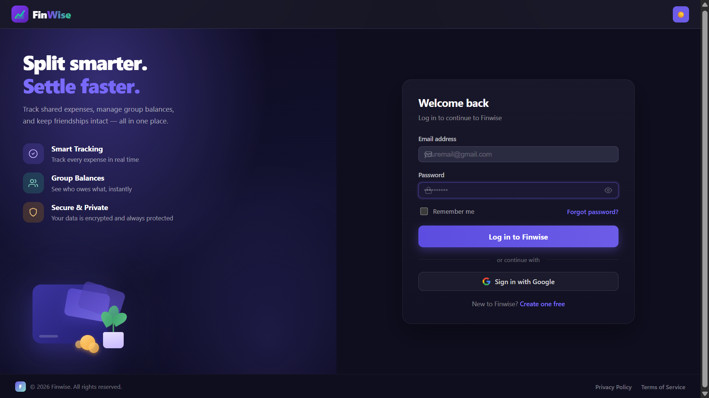

*Authentication interface supporting Google OAuth and email/password login, with a clean onboarding experience built around the FinWise "Split smarter. Settle faster." identity.*

---

## Dashboard

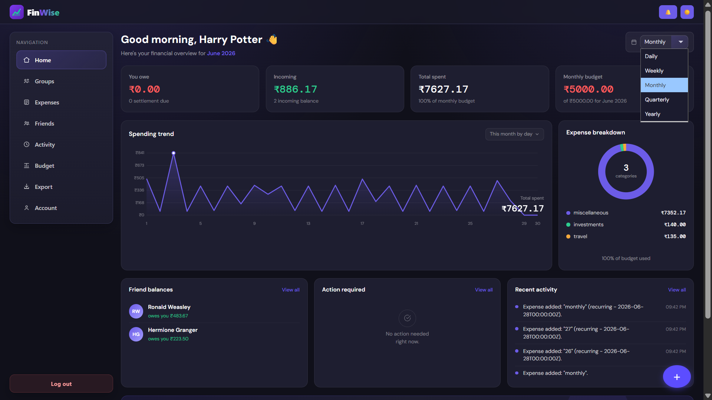

*The central financial overview combines spending trends, category distribution, friend balances, budget progress, action-required information, and configurable time periods.*

---

## Expenses

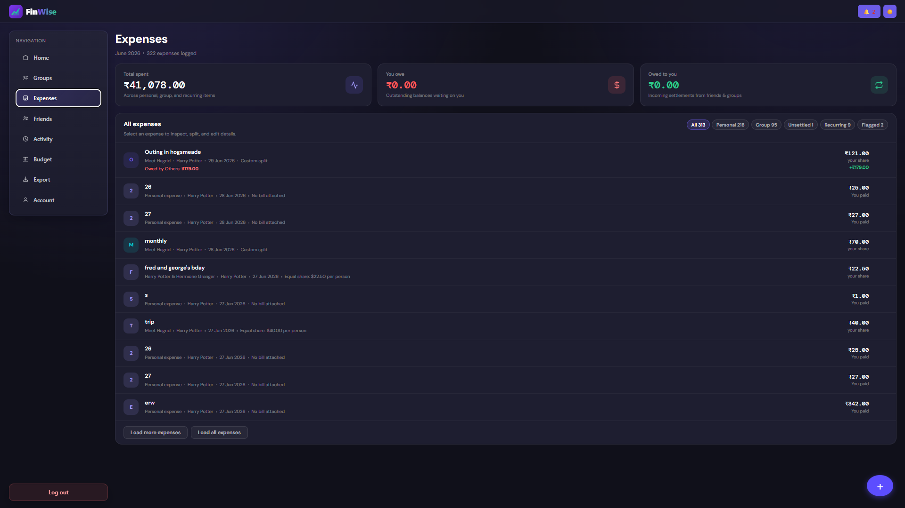

*The expense workspace provides separate views for Personal, Group, Unsettled, Recurring, and Flagged expenses, with summary values for spending and outstanding balances.*

---

## Add Expense — Custom Split

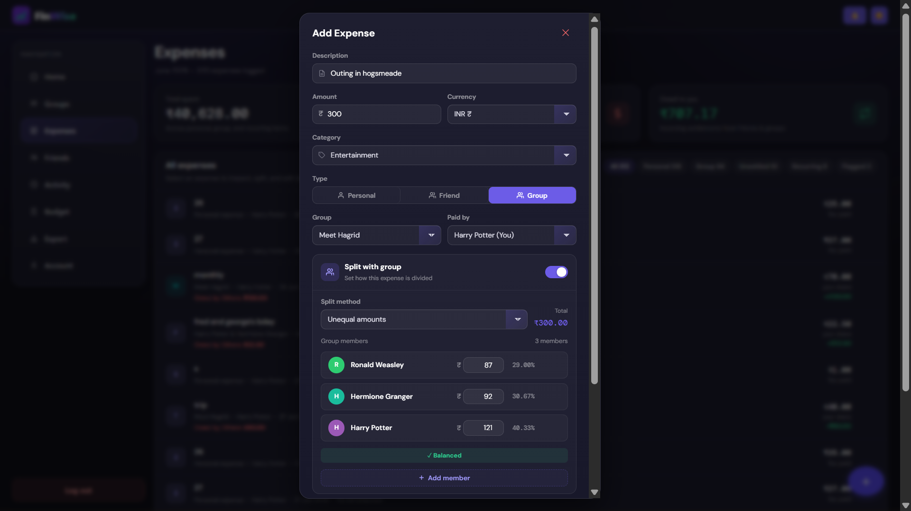

*Expense creation supports equal, unequal, and percentage-based splitting with live calculations and a balance validation indicator.*

---

## Add Expense — Recurring

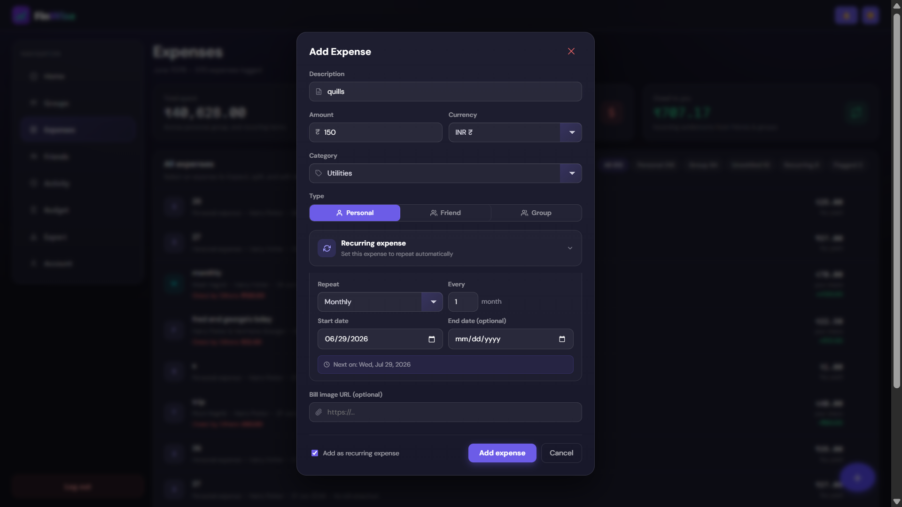

*Recurring expense configuration supports different frequencies and intervals, with the next occurrence previewed before the expense is created.*

---

## Group Detail

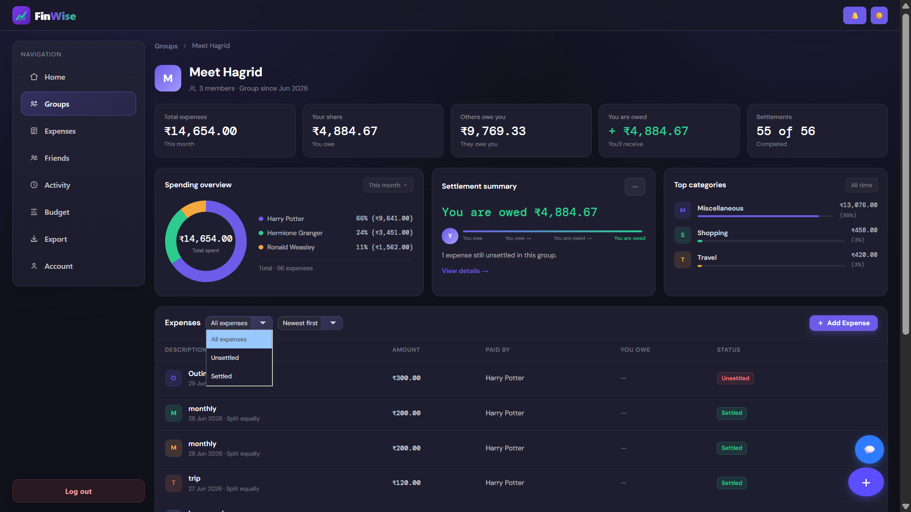

*Detailed group analytics include total spending, individual share, settlement progress, member distribution, category analysis, and a filterable expense table.*

---

## Groups

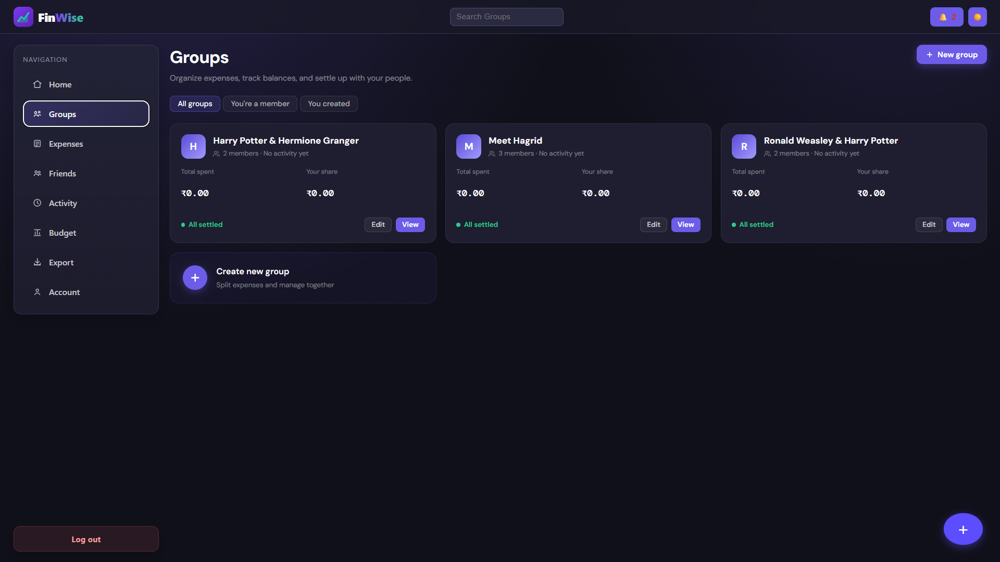

*The groups overview provides a high-level financial summary for each group, including total spending, personal share, and settlement information.*

---

## Expense Detail + Chat

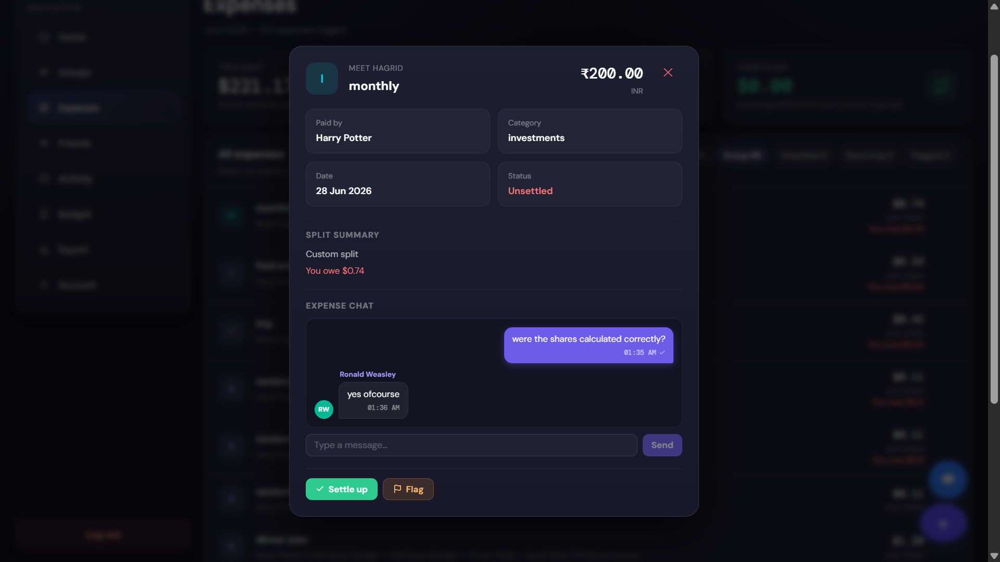

*Each expense can be opened independently to review its details, settlement status, dispute state, and contextual conversation.*

---

## Group Chat

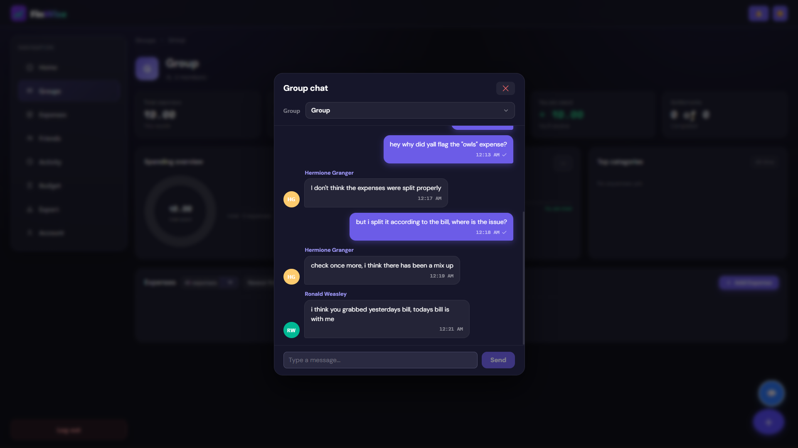

*Group-level communication includes timestamps and read receipts while remaining separate from expense-specific discussions.*

---

## Notifications

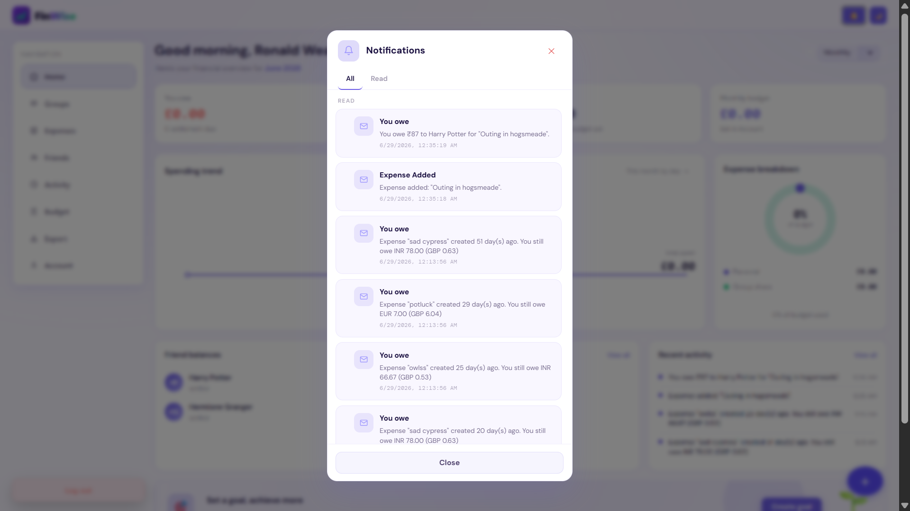

*The notification centre brings together debt alerts, expense activity, settlement reminders, and other account events.*

---

## Activity Feed

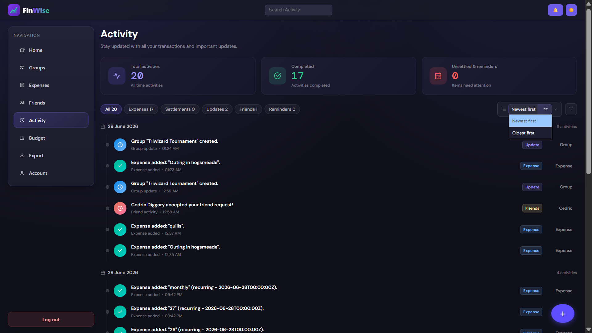

*The activity feed provides a chronological view of expense creation, settlements, recurring transactions, friend activity, and group activity.*

---

## Friends

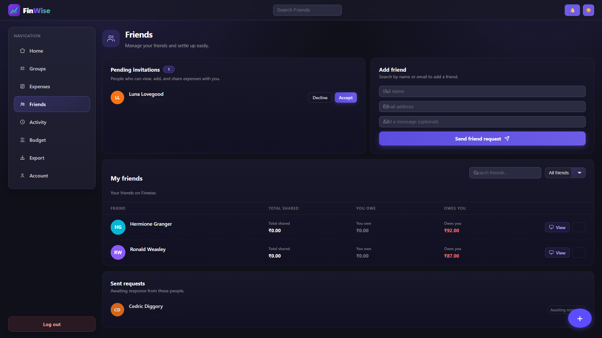

*The friends workspace focuses on shared financial relationships, showing total shared spending, outstanding amounts, and direct reminder or settlement actions.*

---

## Budget

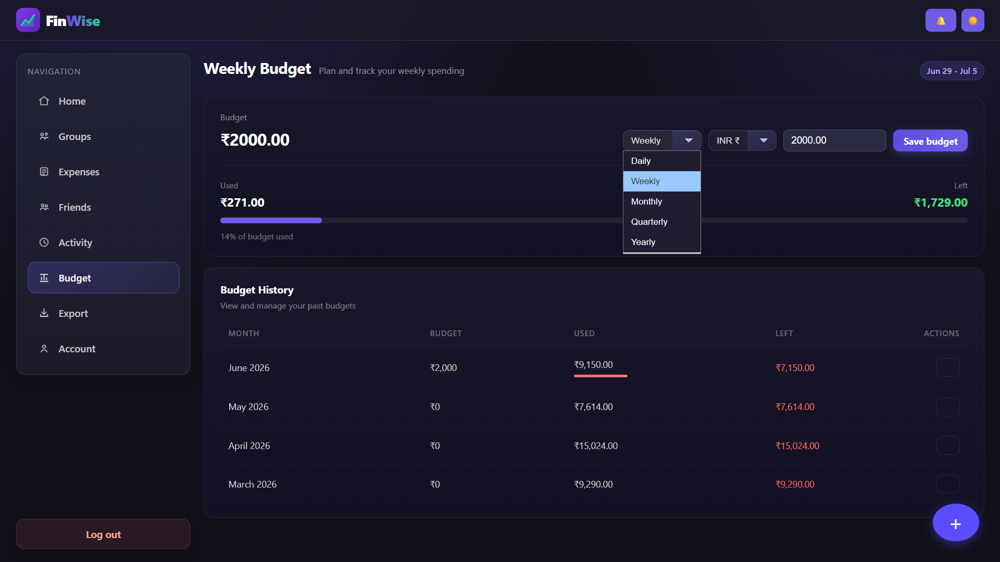

*Budget management supports multiple time periods and maintains historical budget information for longer-term comparison.*

---

## Export

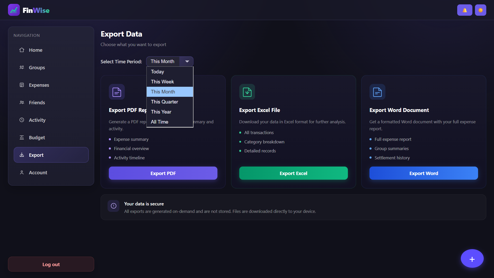

*Financial data can be exported to PDF, Excel, and Word using configurable date filters.*

---

## Account & Preferences

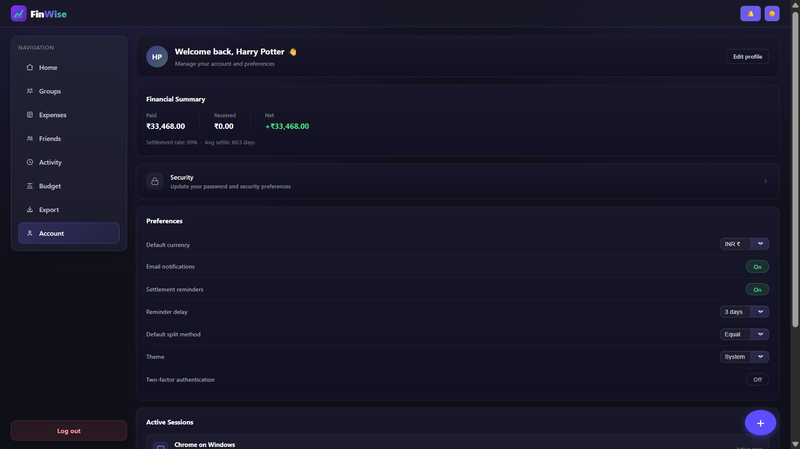

*The account area combines financial health metrics with currency, settlement, split, theme, authentication, and session preferences.*

---

# Architecture

FinWise follows a layered full-stack architecture.

```text
┌──────────────────────────────────────────────────────────┐
│                    React Frontend                        │
│                                                          │
│  React 18 + TypeScript + React Router + Custom CSS      │
│                                                          │
│  Dashboard                                               │
│  Expenses                                                │
│  Groups                                                  │
│  Friends                                                 │
│  Budgets                                                 │
│  Analytics                                               │
│  AI Insights                                             │
│  Notifications                                           │
│  Account                                                 │
└───────────────────────────┬──────────────────────────────┘
                            │
                       REST / JSON
                            │
                            ▼
┌──────────────────────────────────────────────────────────┐
│                   Spring Boot API                        │
│                                                          │
│  Controllers                                             │
│       ↓                                                  │
│  Services                                                │
│       ↓                                                  │
│  Repositories                                            │
│       ↓                                                  │
│  PostgreSQL                                              │
│                                                          │
│  AI Services ───────────────► Groq API                  │
│  Currency Service ─────────► ExchangeRate API          │
└──────────────────────────────────────────────────────────┘
```

---

# Application Flow

A typical expense creation request follows this path:

```text
React UI
   │
   │ POST /api/expenses
   ▼
ExpenseController
   │
   ▼
ExpenseService
   │
   ├── Normalize expense
   │
   ├── Apply category rules
   │
   ├── Validate currency
   │
   ├── Validate recurrence
   │
   ├── Validate custom splits
   │
   ├── Initialize settlement state
   │
   ▼
ExpenseRepository
   │
   ▼
PostgreSQL
   │
   ├── Record activity
   │
   └── Record owed activity
   │
   ▼
React receives saved expense
```

When AI categorisation is required:

```text
ExpenseController
       │
       ▼
ExpenseCategorizationService
       │
       ▼
Groq API
       │
       ▼
Validate returned category
       │
       ▼
ExpenseService
       │
       ▼
Database
```

---

# AI Architecture

FinWise currently uses AI in two distinct workflows.

```text
                         Groq API
                            ▲
                            │
                ┌───────────┴───────────┐
                │                       │
                │                       │
        Expense Categorisation     Financial Insights
                ▲                       ▲
                │                       │
        Expense description      Financial snapshot
                ▲                       ▲
                │                       │
        ExpenseService /          FinancialAnalyticsService
        CategorizationService             │
                                          │
                                   BudgetService
```

The two workflows intentionally have different responsibilities.

### Categorisation

Input:

```text
Expense description
```

Output:

```text
One controlled category
```

### Financial Insights

Input:

```text
Structured financial data
```

Output:

```text
3–5 financial observations
```

This separation prevents the AI layer from becoming a generic, unstructured component.

---

# Data and Validation Strategy

Because FinWise manages financial information, validation is performed on the backend rather than relying exclusively on frontend checks.

Examples include:

### Currency Validation

Only supported currencies are accepted.

### Recurrence Validation

Recurring expenses require:

* Valid recurrence type
* Start date
* Valid interval
* Valid end-date relationship

### Custom Split Validation

The total of custom participant shares must match the expense amount.

### Expense Ownership

Only the creator of an expense is permitted to edit it.

### AI Category Validation

AI-generated categories must exist in the predefined category set.

### Settlement State

Settlement status is derived from individual participant settlement states.

This prevents invalid client-side requests from directly becoming inconsistent financial records.

---

# Tech Stack

## Frontend

| Technology      | Purpose                              |
| --------------- | ------------------------------------ |
| React 18        | Component-based UI                   |
| TypeScript      | Static typing                        |
| React Router v6 | Routing and deep links               |
| Vite            | Build tooling and development server |
| Custom CSS      | Application styling                  |
| Canvas API      | Spending trend chart                 |

The frontend intentionally avoids a large UI component framework.

---

## Backend

| Technology        | Purpose                      |
| ----------------- | ---------------------------- |
| Java 17           | Backend language             |
| Spring Boot       | Application framework        |
| Spring REST       | API layer                    |
| Spring Data       | Persistence abstraction      |
| PostgreSQL        | Relational database          |
| JWT               | Stateless authentication     |
| Google OAuth2     | Social authentication        |
| Jackson           | JSON processing              |
| Java HttpClient   | External HTTP requests       |
| Spring Scheduling | Recurring expense generation |
| Groq API          | AI functionality             |
| ExchangeRate API  | Currency conversion          |

---

## Infrastructure

| Technology       | Purpose             |
| ---------------- | ------------------- |
| Vercel           | Frontend deployment |
| Render           | Backend deployment  |
| PostgreSQL       | Production database |
| Groq             | AI inference        |
| ExchangeRate API | Exchange-rate data  |

---

# Backend Architecture

The backend follows a controller-service-repository approach.

```text
Controller
    │
    ▼
Service
    │
    ├── Business rules
    ├── Validation
    ├── External API calls
    └── Workflow orchestration
    │
    ▼
Repository
    │
    ▼
PostgreSQL
```

Representative services include:

```text
ExpenseService
ExpenseCategorizationService
AiInsightsService
FinancialAnalyticsService
BudgetService
NotificationService
JwtService
ExpenseEditLogService
```

Each service is responsible for a distinct area of application behaviour.

For example:

### ExpenseService

Responsible for:

* Expense creation
* Expense updates
* Expense deletion
* Split calculation
* Settlement
* Recurring expense generation
* Validation
* Activity generation

### ExpenseCategorizationService

Responsible for:

* Calling Groq
* Supplying category constraints
* Extracting the model response
* Validating categories
* Applying fallback behaviour

### AiInsightsService

Responsible for:

* Building financial summaries
* Collecting budget data
* Calling the LLM
* Parsing the response
* Validating the insights structure

---

# Frontend Architecture

The frontend is organised around application-level screens and reusable UI behaviour.

Core areas include:

```text
Authentication
Dashboard
Expenses
Expense Detail
Groups
Group Detail
Friends
Budgets
Analytics
Notifications
Activity
Account
```

React Router provides navigation and deep linking.

Custom CSS handles:

* Theme switching
* Layout
* Cards
* Forms
* Tables
* Modals
* Responsive behaviour
* Financial dashboards
* Status indicators

No external UI framework is required.

---

# Key Engineering Decisions

## 1. No UI library

The interface is built using custom CSS rather than Material UI, Bootstrap, Chakra, Tailwind UI, or another component library.

This provides complete control over the application's visual system.

---

## 2. No charting library

The spending chart is rendered with the browser's native Canvas API.

Instead of adding a dependency for one visualisation, FinWise calculates the required points and draws the chart directly.

This also gives precise control over:

* Axes
* Labels
* Scaling
* Interaction
* Responsive sizing
* Styling

---

## 3. AI output is constrained

LLM responses are treated as untrusted external data.

For categorisation:

```text
LLM output
    ↓
Trim / clean
    ↓
Allowed category lookup
    ↓
Valid?
 ┌──┴──┐
Yes   No
 │     │
 ▼     ▼
Save  miscellaneous
```

This prevents arbitrary model responses from becoming application categories.

---

## 4. AI is grounded in application data

The financial insight system does not ask the model to "guess" the user's financial situation.

Instead:

```text
Database
   ↓
Analytics services
   ↓
Structured financial snapshot
   ↓
AI
```

The model therefore works from data already calculated by the backend.

---

## 5. Recurring expenses are generated server-side

Recurring expenses are not dependent on the frontend remaining open.

The backend scheduler is responsible for determining when an occurrence should be generated.

This makes recurring behaviour independent of a particular user's browser session.

---

## 6. Expense discussions are contextual

A general group chat is not sufficient for financial disputes.

By attaching discussions directly to expenses, users can see:

```text
Expense
+ Participants
+ Amount
+ Split
+ Chat
+ Dispute
+ Settlement
```

in one context.

---

## 7. Audit history is separate from the current state

The current expense record represents the latest state.

The edit log preserves historical state.

This prevents a modification from destroying the ability to understand what changed.

---

# Security

FinWise uses multiple layers of application security.

### Authentication

* Email/password authentication
* Google OAuth
* JWT-based API authentication

### Authorisation

Backend services validate ownership and permissions for protected operations.

For example, expense editing verifies that the authenticated user is the creator of the expense.

### Validation

The backend validates:

* Request data
* Currency values
* Recurrence configuration
* Custom splits
* AI categories
* Settlement operations

### Secrets

External API credentials such as:

* Groq API keys
* JWT secrets
* OAuth secrets
* Database credentials

should be supplied through environment/configuration rather than committed to source control.

---

# Reliability and Error Handling

External APIs can fail, so FinWise does not assume that every external request succeeds.

The AI categorisation service handles:

* Missing API key
* Blank descriptions
* Non-success HTTP responses
* Empty model responses
* Unsupported categories
* JSON/API parsing failures
* Runtime failures
* Interrupted requests

The fallback category is:

```text
miscellaneous
```

For AI financial insights, failures are surfaced as an appropriate backend error rather than silently presenting fabricated financial information.

This distinction is important:

```text
Categorisation failure
        ↓
Safe fallback
```

versus:

```text
Financial analysis failure
        ↓
Explicit failure
        ↓
No fabricated financial insight
```

---

# Getting Started

## Prerequisites

Install:

* Node.js 18+
* Java 17+
* PostgreSQL 14+
* Maven or Maven Wrapper

For complete functionality, configure:

* Groq API credentials
* Google OAuth credentials
* ExchangeRate API credentials

---

# Frontend Setup

Clone the frontend repository:

```bash
git clone https://github.com/yourusername/finwise-frontend.git
```

Navigate into it:

```bash
cd finwise-frontend
```

Install dependencies:

```bash
npm install
```

Create the environment file:

```bash
cp .env.example .env
```

Configure:

```env
VITE_API_BASE_URL=your_backend_url
```

Start the development server:

```bash
npm run dev
```

---

# Backend Setup

Clone the backend:

```bash
git clone https://github.com/yourusername/finwise-api.git
```

Navigate into the project:

```bash
cd finwise-api
```

Configure the backend properties with:

* PostgreSQL connection
* JWT secret
* Google OAuth credentials
* ExchangeRate API key
* Groq API key
* Groq model

Then run:

```bash
./mvnw spring-boot:run
```

On Windows:

```bash
mvnw.cmd spring-boot:run
```

---

# Environment Configuration

A representative backend configuration looks like:

```properties
# PostgreSQL
spring.datasource.url=jdbc:postgresql://localhost:5432/finwise
spring.datasource.username=your_username
spring.datasource.password=your_password

# JWT
jwt.secret=your_secret

# Google OAuth
spring.security.oauth2.client.registration.google.client-id=your_client_id
spring.security.oauth2.client.registration.google.client-secret=your_client_secret

# Currency conversion
exchange.rate.api.key=your_api_key

# Groq
groq.api-key=your_groq_api_key
groq.model=llama-3.1-8b-instant
```

> **Never commit real secrets, API keys, OAuth credentials, database passwords, or JWT secrets to Git.**

---

# Deployment

## Frontend

The React frontend is deployed on Vercel.

```text
React + Vite
      ↓
Vercel
      ↓
finwise-coral.vercel.app
```

---

## Backend

The Spring Boot backend is deployed on Render.

```text
Spring Boot
     ↓
Render
     ↓
finwise-api-rrjv.onrender.com
```

Because the current backend deployment uses a free-tier configuration, cold starts may occur after inactivity.

---

# Project Structure

A simplified representation of the backend structure is:

```text
src/
└── main/
    └── java/
        └── com/
            └── example/
                └── splitwise/
                    ├── controller/
                    │   ├── ExpenseController
                    │   ├── AiInsightsController
                    │   └── ...
                    │
                    ├── service/
                    │   ├── ExpenseService
                    │   ├── ExpenseCategorizationService
                    │   ├── AiInsightsService
                    │   ├── FinancialAnalyticsService
                    │   ├── BudgetService
                    │   ├── NotificationService
                    │   ├── JwtService
                    │   └── ...
                    │
                    ├── repository/
                    │   ├── ExpenseRepository
                    │   ├── UserRepository
                    │   ├── ActivityRepository
                    │   └── ...
                    │
                    └── model/
                        ├── Expense
                        ├── BudgetSummary
                        ├── Activity
                        └── ...
```

The frontend follows a screen/component-oriented structure around the main product areas.

---

# Feature Matrix

| Area           | Features                                                |
| -------------- | ------------------------------------------------------- |
| Expenses       | Personal, group, recurring, categorisation, attachments |
| Splitting      | Equal, unequal, percentage                              |
| Settlement     | Individual settlement, settle-all-with-friend           |
| Groups         | Members, expenses, analytics, chat                      |
| Friends        | Shared workspace, balances, reminders                   |
| Disputes       | Flagging + expense-specific chat                        |
| Budgets        | Daily, weekly, monthly, quarterly, yearly               |
| Analytics      | Spending trends, category analysis, settlement metrics  |
| AI             | Expense categorisation + financial insights             |
| Communication  | Group chat + expense chat                               |
| Notifications  | Debt alerts, activity, reminders                        |
| Audit          | Expense edit history                                    |
| Currency       | INR, USD, EUR, GBP, JPY                                 |
| Export         | PDF, Excel, Word                                        |
| Authentication | Email/password, Google OAuth, JWT                       |
| Account        | Preferences, 2FA, active sessions                       |
| Routing        | Deep links                                              |
| Theming        | Light, dark, system                                     |

---

# Example End-to-End Expense Workflow

Consider an expense:

```text
Description:
"Uber ride from airport"

Amount:
₹850

Participants:
Alice
Bob
Charlie
```

The application processes it approximately as:

```text
                    User
                     │
                     ▼
             Add Expense Form
                     │
                     ▼
              ExpenseController
                     │
                     ▼
               ExpenseService
                     │
             ┌───────┴────────┐
             │                │
             ▼                ▼
        Normalisation     AI Category
                              │
                              ▼
                         Groq API
                              │
                              ▼
                         transport
             │
             ▼
        Split validation
             │
             ▼
      Settlement state
             │
             ▼
       PostgreSQL
             │
        ┌────┴─────┐
        ▼          ▼
     Activity    Owed state
        │          │
        └────┬─────┘
             ▼
        Saved Expense
```

This single workflow demonstrates how the application's API, business logic, AI integration, validation, persistence, activity system, and settlement system work together.

---

# Example Financial Insight Workflow

Suppose the application calculates:

```text
Current spending:       ₹18,400
Previous period:       ₹15,900
Budget:                ₹20,000
Budget used:                92%
Top category:             Travel
```

The backend constructs a structured financial snapshot and sends it to the AI service.

The AI is instructed to:

1. Identify a meaningful observation.
2. Explain why it matters.
3. Provide a realistic action.
4. Use actual supplied numbers.
5. Avoid inventing unsupported values.
6. Return only 3–5 concise insights.

This makes the AI feature an extension of the analytics system rather than a generic conversational interface.

---

# Performance and Dependency Philosophy

FinWise intentionally avoids adding dependencies for functionality that can reasonably be implemented within the application.

Examples:

### Charts

Instead of:

```text
React
 +
Charting Library
```

FinWise uses:

```text
React
 +
Canvas API
```

### UI

Instead of:

```text
React
 +
UI Framework
 +
Theme Framework
```

FinWise uses:

```text
React
 +
TypeScript
 +
Custom CSS
```

The goal is not simply to minimise dependencies, but to maintain control over the parts of the application that define the product's experience.

---

# Design Philosophy

FinWise follows several product principles.

### Financial context should stay attached to financial objects.

That is why expenses have their own discussions.

### Users should not have to manually repeat predictable work.

That is why recurring expenses and settle-all workflows exist.

### Financial data should be explainable.

That is why the application provides analytics, budget comparisons, activity history, and AI insights.

### AI should assist the application, not control it.

That is why AI output is constrained and validated.

### Important operations should be auditable.

That is why expense modifications have an edit history.

### The interface should remain understandable despite the feature depth.

That is why the application separates:

```text
Expenses
Groups
Friends
Budgets
Analytics
Activity
Notifications
Account
```

into distinct workflows.

---

# Roadmap

The core platform and current AI functionality are implemented. Potential future improvements include:

* [ ] React Native mobile application
* [ ] OCR-based bill and receipt scanning
* [ ] UPI payment integration
* [ ] WhatsApp settlement reminders
* [ ] Advanced AI spending forecasts
* [ ] Automated budget recommendations
* [ ] Predictive recurring-expense detection
* [ ] More advanced financial trend comparisons
* [ ] Expanded notification integrations
* [ ] Additional export formats
* [ ] More granular financial reporting

---

# What This Project Demonstrates

FinWise is intended to demonstrate the ability to build and integrate a substantial full-stack application rather than only individual isolated features.

The project covers:

### Frontend Engineering

* React
* TypeScript
* Routing
* Custom CSS
* Responsive layouts
* State-driven UI
* Modal workflows
* Financial dashboards
* Canvas rendering
* Theme management

### Backend Engineering

* Java 17
* Spring Boot
* REST APIs
* Service-layer architecture
* Repository patterns
* Scheduled processing
* Validation
* Business rules
* External API integration

### Database Engineering

* PostgreSQL
* Persistent financial entities
* Relationships between users, groups, friends, and expenses
* Settlement state
* Activity history
* Audit history
* Recurring expense relationships

### Authentication

* JWT
* Google OAuth
* Protected API operations
* Session management
* Two-factor authentication support

### Financial Application Logic

* Expense splitting
* Custom split validation
* Settlement tracking
* Budget calculations
* Currency conversion
* Spending analytics
* Historical comparisons

### AI Engineering

* LLM API integration
* Prompt design
* Structured output requirements
* Controlled category generation
* Response sanitisation
* AI fallback behaviour
* Financial-data grounding
* JSON response parsing
* AI failure handling

### Product Engineering

* Expense disputes
* Contextual communication
* Notifications
* Settlement reminders
* Recurring workflows
* Reporting
* Auditability
* Deep links
* Account preferences

---

# FinWise in One View

```text
                         FINWISE
                            │
        ┌───────────────────┼────────────────────┐
        │                   │                    │
        ▼                   ▼                    ▼
     EXPENSES            PEOPLE              FINANCIALS
        │                   │                    │
   ┌────┼────┐         ┌────┼────┐         ┌────┼────┐
   │    │    │         │    │    │         │    │    │
Personal Group Recurring Friends Groups   Budgets Analytics AI
   │    │    │         │    │    │         │    │    │
   └────┼────┘         └────┼────┘         └────┼────┘
        │                   │                    │
        ▼                   ▼                    ▼
     Splits             Settlement          Insights
        │                   │                    │
        ▼                   ▼                    ▼
     Disputes            Reminders          Recommendations
        │
        ▼
      Chat
        │
        ▼
   Activity / Audit
```

---

# Final Overview

FinWise started from the basic problem of splitting expenses but evolved into a broader financial collaboration platform.

It combines the transactional side of expense management:

```text
Create → Split → Track → Settle
```

with the analytical side:

```text
Categorise → Budget → Analyse → Understand
```

and the collaborative side:

```text
Discuss → Dispute → Notify → Resolve
```

The addition of AI extends this workflow further:

```text
Expense Description
       ↓
AI Categorisation

Financial Data
       ↓
Analytics
       ↓
AI Financial Insights
       ↓
Practical Recommendations
```

The result is a full-stack system where **expenses are not treated as isolated database records**. They become part of a larger financial lifecycle involving people, groups, settlements, budgets, conversations, analytics, historical records, and intelligent assistance.

---

# License

This project is currently maintained as a personal portfolio project.
